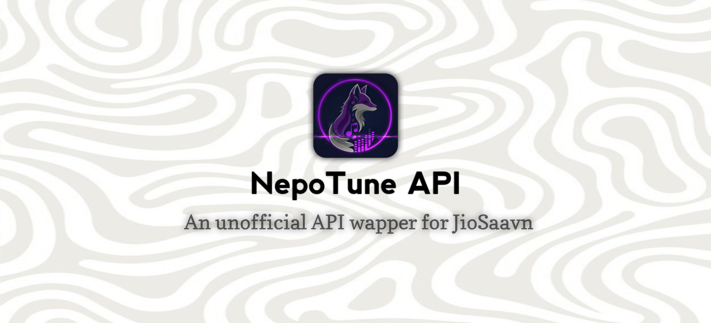

<div align="center">

# NepoTuneAPI (JioSaavn Unofficial API)




[📚 Documentation](https://nepotuneapi.vercel.app/docs) • [🌐 Demo](https://nepotuneapi.vercel.app)

</div>

---

An **Unofficial High-Performance API** to fetch and download high-quality songs, albums, playlists, lyrics, and more from [JioSaavn](https://jiosaavn.com).  
Built on [Hono.js](https://hono.dev), works seamlessly across Bun, Node.js, Cloudflare Workers & Vercel.

---

## ✨ Features

- 🚀 **High Performance** – powered by [Hono.js](https://hono.dev)
- 🎶 **Rich Content** – fetch songs, albums, artists, playlists, and lyrics
- 🌍 **Cross-Platform** – runs on Bun, Node.js, Cloudflare Workers, and Vercel
- 🪶 **Lightweight** – minimal dependencies, easy setup & deployment
- 🔒 **No Auth Required** – most endpoints are ready to use instantly
- ❤️ **Open Source** – MIT Licensed

---

## 📚 Documentation

Check out the full [API documentation](https://nepotuneapi.vercel.app/docs) for detailed usage and endpoints.

---

## 🚀 Quick Start

Clone the repository:

```sh
git clone https://github.com/Sandipeyy/NepoTuneAPI
cd NepoTuneAPI
```

### Using Docker

```sh
docker-compose up
```

### Or Run Manually

> **Note:** Requires `Bun (1.0.29+)` or `Node.js (v20+)`

```sh
bun install
bun run dev
```

Or with Node.js:

```sh
npm install
npm run dev
```

---

## ⚡ Example Usage

Fetch a song by ID:

```sh
curl https://nepotuneapi.vercel.app/api/songs?id=xyz123
```

Sample Response:

```json
{
  "id": "xyz123",
  "title": "Song Title",
  "artist": "Artist Name",
  ...
}
```

---

## 🔥 Use Cases

- Build music discovery bots
- Integrate high-quality streaming in your app
- Create custom playlists or lyric viewers

---

## 📰 Changelog

See [CHANGELOG](CHANGELOG.md) for updates and release history.

---

## 🤝 Contributing

Contributions are welcome! Please read our [CONTRIBUTING.md](CONTRIBUTING.md) and open an Issue or Pull Request.

---

## 💬 Community & Support

- [Open an Issue](https://github.com/Sandipeyy/NepoTuneAPI/issues)
- [Start a Discussion](https://github.com/Sandipeyy/NepoTuneAPI/discussions)
- Email: [977senpai@gmail.com](mailto:977senpai@gmail.com)

---

## ⚠️ Disclaimer

This project is not affiliated with or endorsed by JioSaavn.  
Use responsibly and adhere to JioSaavn's terms of service.

---

## 📜 License

Distributed under the [MIT License]([https://raw.githubusercontent.com/Sandipeyy/NepoTuneAPI/refs/heads/main/LICENSE]).  
See [LICENSE](LICENSE) for details.

---

## 👥 Contributors

<!-- ALL-CONTRIBUTORS-BADGE:START - Do not remove or modify this section -->
[](https://github.com/Sandipeyy/NepoTuneAPI/graphs/contributors)
<!-- ALL-CONTRIBUTORS-BADGE:END -->

Thanks to all [our contributors](https://github.com/Sandipeyy/NepoTuneAPI/graphs/contributors) for their help and support!